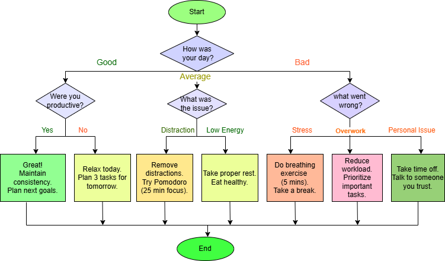

# Daily Reflection Decision Tree

## Objective
This project implements a deterministic decision tree to help users reflect on their daily experiences and receive structured suggestions.

## Approach
The system uses a rule-based decision tree instead of probabilistic AI models to ensure:
- Consistency
- Explainability
- No hallucinations

## Decision Flow
1. User selects day type: Good / Average / Bad
2. System asks follow-up questions
3. Outputs actionable suggestions

  ## Decision Tree Diagram

## Features
- Simple user interaction
- Clear and logical outputs
- Structured decision-making

## Guardrails
- Only predefined responses are used
- No random AI-generated answers
- Input validation included
- Fallback for invalid inputs

## Files
- decision_tree.py → Python implementation
- decision_tree.png → Visual representation

## Future Improvements
- Add AI explanation layer
- Convert into chatbot interface
